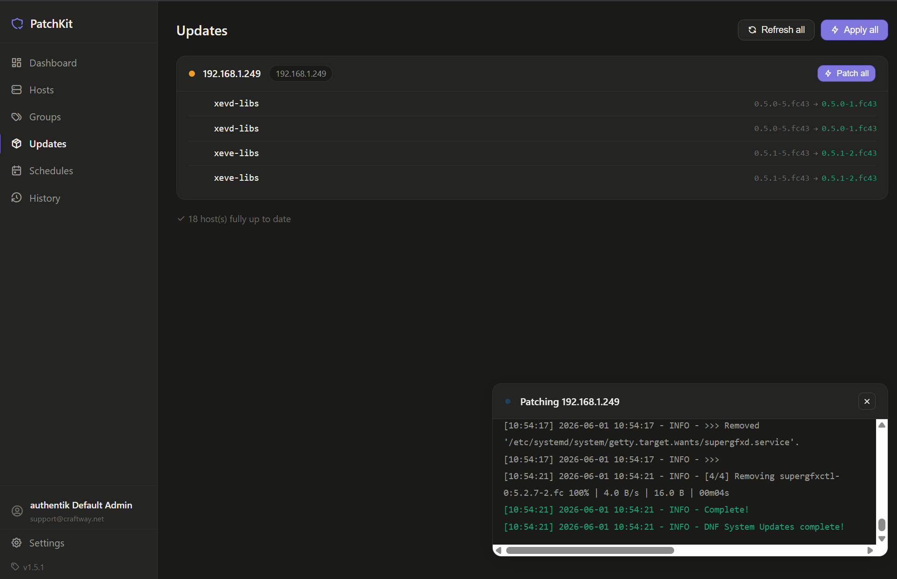

# PatchKit

A lightweight home server patch manager. SSH into your Linux hosts, check for pending package updates, apply upgrades, and track reboot requirements from a single web UI.

## Screenshots




## Features

- **Dashboard** - at-a-glance view of all hosts, pending updates, security flags, and reboot status
- **Hosts** - add, edit, scan, and patch individual servers over SSH
- **Credentials** - store SSH keys and sudo config in the database; assign to hosts by name
- **Groups** - tag-based host groups with bulk scan, patch, and rolling reboot
- **Updates** - per-host pending package list with live search filter
- **Schedules** - cron-based automated patching with per-schedule host selection
- **History** - full patch run logs with per-run output
- **Notifications** - email (SMTP) and webhook (Telegram, Slack, Discord, ntfy, etc.)
- **Sudo elevation** - connect as a non-root user; PatchKit wraps privileged commands with sudo automatically (NOPASSWD or password)
- **Authentication** - optional built-in OpenID Connect login (Authentik, Keycloak, Authelia, etc.) with group restriction, or reverse-proxy forward auth
- **Mobile** - responsive layout with collapsing sidebar
- **Supports** apt (Debian, Ubuntu, Raspberry Pi OS) and dnf/rpm (Fedora, Rocky Linux, RHEL, AlmaLinux, CentOS, Nobara)
- **Auto-refresh** - dashboard silently updates every 30 seconds

## Docker

```bash
docker volume create patchkit-data

docker run -d \
  --name patchkit \
  --restart unless-stopped \
  -p 8080:8080 \
  -v patchkit-data:/app/data \
  ghcr.io/msmcpeake/patchkit:latest
```

Or with Docker Compose:

```bash
curl -O https://raw.githubusercontent.com/msmcpeake/patchkit/main/docker-compose.yml
docker compose up -d
```

Open `http://your-server:8080`. PatchKit runs with no authentication out of the box — see [Authentication](#authentication) to lock it down.

## Requirements

- Python 3.11+
- SSH access to your hosts (ed25519 key recommended)
- Linux host to run PatchKit on

No third-party auth libraries are needed — OpenID Connect is implemented with the Python standard library.

## Install

```bash
git clone https://github.com/msmcpeake/patchkit.git
cd patchkit

python3 -m venv .venv
.venv/bin/pip install -r requirements.txt

uvicorn app:app --host 0.0.0.0 --port 8080
```

Open `http://your-server:8080`.

## Run as a systemd service

```bash
# Create a dedicated low-privilege user
useradd --system --home-dir /opt/patchkit --no-create-home --shell /usr/sbin/nologin patchkit
chown -R patchkit:patchkit /opt/patchkit

cp patchkit.service /etc/systemd/system/
systemctl daemon-reload
systemctl enable --now patchkit
```

Edit `WorkingDirectory` and `ExecStart` in `patchkit.service` if you installed somewhere other than `/opt/patchkit`. The unit reads optional environment overrides (including OIDC settings) from `/opt/patchkit/oidc.env` if present — see `oidc.env.example`.

## SSH credentials

The recommended approach is to use **Credential sets** (Credentials page in the UI). Paste your private key content directly into the database; no file path management needed. Assign a credential to one or many hosts.

If you prefer path-based keys, set the key path per-host or globally in **Settings -> SSH defaults**. Paths are relative to the user running the service (e.g. the `patchkit` system user's home directory).

```bash
# Generate a dedicated key
ssh-keygen -t ed25519 -f ~/.ssh/patchkit_id -C "patchkit"

# Copy to each host
ssh-copy-id -i ~/.ssh/patchkit_id.pub user@192.168.1.x
```

## Sudo elevation

If your hosts do not allow direct root SSH, set the SSH user to a non-root account. PatchKit detects non-root users and automatically wraps privileged commands with `sudo`. Configure the sudo password (or leave blank for NOPASSWD) on the credential set or per-host in the host edit modal, with a global fallback in **Settings -> SSH defaults**.

Typical sudoers line for NOPASSWD:
```
youruser ALL=(ALL) NOPASSWD: ALL
```

## Authentication

PatchKit ships with **no authentication enabled**. Choose one of the options below, or leave it open on a trusted network.

> **Anyone who can reach port 8080 can manage your hosts.** When you enable proxy-based auth (OIDC redirect handling or forward auth) behind a reverse proxy, also set `PATCHKIT_TRUSTED_PROXIES` so requests that skip the proxy are rejected, and firewall port 8080 to the proxy only.

### OpenID Connect (recommended)

Native OIDC login using the Authorization Code flow with PKCE. Works with any compliant provider (Authentik, Keycloak, Authelia, Zitadel, Google, etc.). Sessions are stored server-side and can be revoked; logout is real.

Enable it by setting these environment variables. All four required vars must be present to turn OIDC on — if any is unset, OIDC stays off:

| Variable | Required | Description |
| --- | --- | --- |
| `PATCHKIT_OIDC_ISSUER` | yes | Issuer / discovery base URL (PatchKit reads `<issuer>/.well-known/openid-configuration`) |
| `PATCHKIT_OIDC_CLIENT_ID` | yes | OAuth2 client ID |
| `PATCHKIT_OIDC_CLIENT_SECRET` | yes | OAuth2 client secret (confidential client) |
| `PATCHKIT_OIDC_REDIRECT_URI` | yes | Must be `https://<your-domain>/auth/callback` |
| `PATCHKIT_OIDC_REQUIRED_GROUP` | no | If set, only users whose `groups` claim contains this value may log in |
| `PATCHKIT_OIDC_SCOPES` | no | Space-separated scopes (default `openid email profile`; add `groups` if your provider needs it for the group claim) |
| `PATCHKIT_SESSION_TTL_HOURS` | no | Session lifetime in hours (default `12`) |

On your identity provider, register a confidential OAuth2/OIDC client:

- **Redirect URI:** `https://<your-domain>/auth/callback`
- **Grant type:** Authorization Code (with PKCE / S256)
- **Scopes:** `openid`, `email`, `profile` (plus `groups` if you use `PATCHKIT_OIDC_REQUIRED_GROUP`)

> **Authentik tip:** providers created via the API can have an empty `grant_types`, which makes the login redirect fail with *"Invalid grant_type for provider."* Ensure the provider allows `authorization_code` (and `refresh_token`).

Auth endpoints: `/auth/login`, `/auth/callback`, `/auth/logout`. Unauthenticated browsers are redirected to the provider; API calls get `401`.

### Reverse-proxy forward auth (alternative)

If your proxy already authenticates users (Authentik/Authelia outpost, nginx `auth_request`, Caddy `forward_auth`, etc.), it can inject a trusted identity header instead. Set that header name in **Settings -> Access control** (e.g. `X-Authentik-Username` or `Remote-User`); PatchKit trusts its value as the logged-in user.

Because the header is trusted, you **must** restrict direct access so clients can't set it themselves — set `PATCHKIT_TRUSTED_PROXIES` to your proxy's IP(s) and firewall port 8080. To recover from a lockout, clear the `auth_header` value in the `settings` table with any SQLite client.

## Reverse proxy

PatchKit listens on port 8080. Put it behind a reverse proxy to handle TLS. Live patch output uses server-sent events, so disable response buffering.

### nginx

```nginx
server {
    listen 443 ssl;
    server_name patchkit.example.com;

    ssl_certificate     /etc/letsencrypt/live/example.com/fullchain.pem;
    ssl_certificate_key /etc/letsencrypt/live/example.com/privkey.pem;

    location / {
        proxy_pass         http://127.0.0.1:8080;
        proxy_http_version 1.1;
        proxy_set_header   Upgrade $http_upgrade;
        proxy_set_header   Connection "upgrade";
        proxy_set_header   Host $host;
        proxy_set_header   X-Real-IP $remote_addr;
        proxy_set_header   X-Forwarded-For $proxy_add_x_forwarded_for;
        proxy_set_header   X-Forwarded-Proto $scheme;
        proxy_buffering    off;
        proxy_read_timeout 300s;
    }
}
```

### Caddy

```caddy
patchkit.example.com {
    reverse_proxy localhost:8080 {
        transport http {
            read_buffer 0
        }
    }
}
```

## Rolling reboot

Groups support a rolling reboot that reboots hosts one at a time. PatchKit waits for SSH to go down, waits for it to come back, holds a configurable grace period, then rescans to clear the reboot-required flag before moving to the next host. Useful for Kubernetes nodes where you need to maintain cluster quorum.

## Webhook notifications

Configure in **Settings -> Webhook**. After every patch run PatchKit POSTs a JSON payload.

Available placeholders: `{host}` `{result}` `{result_upper}` `{packages}` `{duration}`

**Telegram example:**
```
URL:      https://api.telegram.org/bot<TOKEN>/sendMessage
Template: {"chat_id":"<CHAT_ID>","text":"PatchKit: {host} - {result_upper}\n{packages} packages in {duration}s"}
```

ntfy, Gotify, Slack, and Discord all work the same way.

## Stack

- **Backend**: FastAPI, Paramiko, APScheduler
- **Frontend**: Single-page vanilla JS (no build step, no framework)
- **Database**: SQLite
- **Process**: uvicorn

## License

MIT
