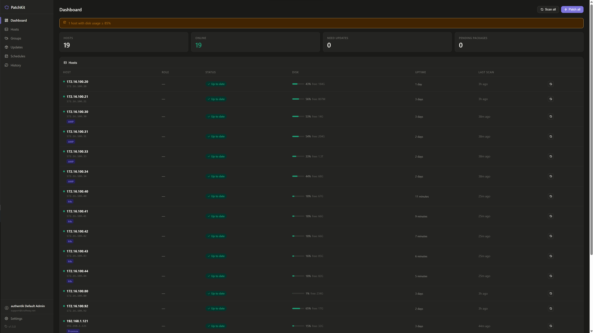
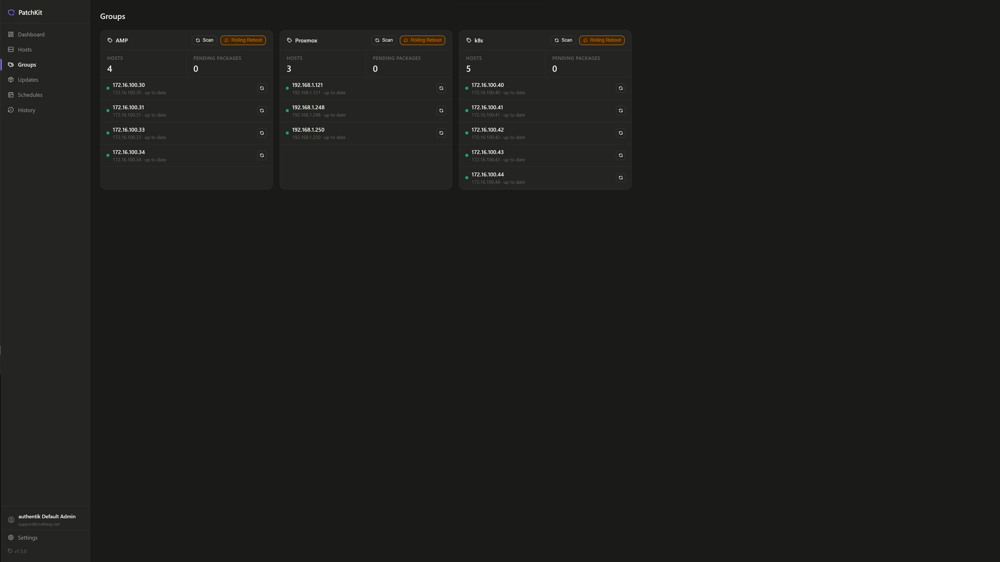

# PatchKit

A lightweight home server patch manager. SSH into your Linux hosts, check for pending package updates, apply upgrades, and track reboot requirements from a single web UI.




## Features

- **Dashboard** - at-a-glance view of all hosts, pending updates, security flags, and reboot status
- **Hosts** - add, edit, scan, and patch individual servers over SSH
- **Groups** - tag-based host groups with bulk scan, patch, and rolling reboot
- **Updates** - per-host pending package list with security package highlighting
- **Schedules** - cron-based automated patching with per-schedule host selection
- **History** - full patch run logs with per-run output
- **Notifications** - email (SMTP) and webhook (Telegram, Slack, Discord, ntfy, etc.)
- **Supports** apt (Debian, Ubuntu, Raspberry Pi OS) and dnf/rpm (Fedora, Rocky Linux, RHEL, AlmaLinux, CentOS, Nobara)
- **Forward auth** - optional reverse proxy authentication (Authentik, Authelia, etc.)
- **Auto-refresh** - dashboard silently updates every 30 seconds

## Requirements

- Python 3.11+
- SSH key access to your hosts (ed25519 recommended)
- Linux host to run PatchKit on

## Install

```bash
git clone https://github.com/msmcpeake/patchkit.git
cd patchkit

python3 -m venv .venv
.venv/bin/pip install -r requirements.txt

uvicorn app:app --host 0.0.0.0 --port 8080
```

Open `http://your-server:8080`.

## Run as a systemd service

```bash
# Create a dedicated low-privilege user
useradd --system --home-dir /opt/patchkit --no-create-home --shell /usr/sbin/nologin patchkit
chown -R patchkit:patchkit /opt/patchkit

cp patchkit.service /etc/systemd/system/
systemctl daemon-reload
systemctl enable --now patchkit
```

Edit `WorkingDirectory` and `ExecStart` in `patchkit.service` if you installed somewhere other than `/opt/patchkit`.

## SSH key setup

PatchKit uses SSH key auth to connect to hosts. It defaults to `~/.ssh/id_ed25519` (relative to the user running the service). Override per-host or globally in **Settings -> SSH defaults**.

```bash
# Generate a dedicated key (recommended)
ssh-keygen -t ed25519 -f ~/.ssh/patchkit -C "patchkit"

# Copy to each host
ssh-copy-id -i ~/.ssh/patchkit.pub root@192.168.1.x
```

## Webhook notifications

Configure in **Settings -> Webhook**. After every patch run PatchKit POSTs a JSON payload.

Available placeholders: `{host}` `{result}` `{result_upper}` `{packages}` `{duration}`

**Telegram example:**
```
URL:      https://api.telegram.org/bot<TOKEN>/sendMessage
Template: {"chat_id":"<CHAT_ID>","text":"PatchKit: {host} - {result_upper}\n{packages} packages in {duration}s"}
```

ntfy, Gotify, Slack, and Discord all work the same way - just provide the webhook URL and a matching template.

## Forward auth

Set a header name in **Settings -> Access control** (e.g. `X-Authentik-Username`). When PatchKit sees this header on an incoming request it trusts the value as the logged-in user identity. Any reverse proxy that performs authentication and injects a trusted header works (Authentik, Authelia, Caddy, nginx auth_request, etc.).

Configure your proxy before enabling this setting. If the header is set but your proxy is not configured to inject it, you will be locked out. To recover: stop PatchKit, open `patchkit.db` with any SQLite client, and set `auth_header` to an empty string in the `settings` table.

## Rolling reboot

Groups support a rolling reboot that reboots hosts one at a time. After each reboot, PatchKit waits for SSH to go down, waits for it to come back, holds a configurable grace period, then rescans the host to clear the reboot-required flag before moving to the next host. Useful for Kubernetes nodes where you need to maintain cluster quorum.

## Stack

- **Backend**: FastAPI, Paramiko, APScheduler
- **Frontend**: Single-page vanilla JS (no build step, no framework)
- **Database**: SQLite
- **Process**: uvicorn

## License

MIT
